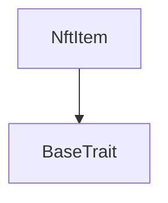
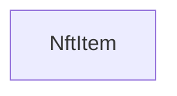

# TACT Compilation Report
Contract: NftItem
BOC Size: 1941 bytes

# Types
Total Types: 20

## StateInit
TLB: `_ code:^cell data:^cell = StateInit`
Signature: `StateInit{code:^cell,data:^cell}`

## StdAddress
TLB: `_ workchain:int8 address:uint256 = StdAddress`
Signature: `StdAddress{workchain:int8,address:uint256}`

## VarAddress
TLB: `_ workchain:int32 address:^slice = VarAddress`
Signature: `VarAddress{workchain:int32,address:^slice}`

## Context
TLB: `_ bounced:bool sender:address value:int257 raw:^slice = Context`
Signature: `Context{bounced:bool,sender:address,value:int257,raw:^slice}`

## SendParameters
TLB: `_ bounce:bool to:address value:int257 mode:int257 body:Maybe ^cell code:Maybe ^cell data:Maybe ^cell = SendParameters`
Signature: `SendParameters{bounce:bool,to:address,value:int257,mode:int257,body:Maybe ^cell,code:Maybe ^cell,data:Maybe ^cell}`

## LogEventMintRecord
TLB: `log_event_mint_record#a3877d65 minter:address item_id:int257 generate_number:int257 = LogEventMintRecord`
Signature: `LogEventMintRecord{minter:address,item_id:int257,generate_number:int257}`

## CollectionData
TLB: `_ next_item_index:int257 collection_content:^cell owner_address:address = CollectionData`
Signature: `CollectionData{next_item_index:int257,collection_content:^cell,owner_address:address}`

## Transfer
TLB: `transfer#5fcc3d14 query_id:uint64 new_owner:address response_destination:Maybe address custom_payload:Maybe ^cell forward_amount:coins forward_payload:remainder<slice> = Transfer`
Signature: `Transfer{query_id:uint64,new_owner:address,response_destination:Maybe address,custom_payload:Maybe ^cell,forward_amount:coins,forward_payload:remainder<slice>}`

## OwnershipAssigned
TLB: `ownership_assigned#05138d91 query_id:uint64 prev_owner:address forward_payload:remainder<slice> = OwnershipAssigned`
Signature: `OwnershipAssigned{query_id:uint64,prev_owner:address,forward_payload:remainder<slice>}`

## Excesses
TLB: `excesses#d53276db query_id:uint64 = Excesses`
Signature: `Excesses{query_id:uint64}`

## GetStaticData
TLB: `get_static_data#2fcb26a2 query_id:uint64 = GetStaticData`
Signature: `GetStaticData{query_id:uint64}`

## ReportStaticData
TLB: `report_static_data#8b771735 query_id:uint64 index_id:int257 collection:address = ReportStaticData`
Signature: `ReportStaticData{query_id:uint64,index_id:int257,collection:address}`

## GetNftData
TLB: `_ is_initialized:bool index:int257 collection_address:address owner_address:address individual_content:^cell = GetNftData`
Signature: `GetNftData{is_initialized:bool,index:int257,collection_address:address,owner_address:address,individual_content:^cell}`

## ProveOwnership
TLB: `prove_ownership#04ded148 query_id:uint64 dest:address forward_payload:^cell with_content:bool = ProveOwnership`
Signature: `ProveOwnership{query_id:uint64,dest:address,forward_payload:^cell,with_content:bool}`

## RequestOwner
TLB: `request_owner#d0c3bfea query_id:uint64 dest:address forward_payload:^cell with_content:bool = RequestOwner`
Signature: `RequestOwner{query_id:uint64,dest:address,forward_payload:^cell,with_content:bool}`

## OwnershipProof
TLB: `ownership_proof#0524c7ae query_id:uint64 item_id:uint256 owner:address data:^cell revoked_at:uint64 content:Maybe ^cell = OwnershipProof`
Signature: `OwnershipProof{query_id:uint64,item_id:uint256,owner:address,data:^cell,revoked_at:uint64,content:Maybe ^cell}`

## OwnerInfo
TLB: `owner_info#0dd607e3 query_id:uint64 item_id:uint256 initiator:address owner:address data:^cell revoked_at:uint64 content:Maybe ^cell = OwnerInfo`
Signature: `OwnerInfo{query_id:uint64,item_id:uint256,initiator:address,owner:address,data:^cell,revoked_at:uint64,content:Maybe ^cell}`

## Revoke
TLB: `revoke#6f89f5e3 query_id:uint64 = Revoke`
Signature: `Revoke{query_id:uint64}`

## NftCollection$Data
TLB: `null`
Signature: `null`

## NftItem$Data
TLB: `null`
Signature: `null`

# Get Methods
Total Get Methods: 3

## get_nft_data

## get_authority_address

## get_revoked_time

# Error Codes
2: Stack underflow
3: Stack overflow
4: Integer overflow
5: Integer out of expected range
6: Invalid opcode
7: Type check error
8: Cell overflow
9: Cell underflow
10: Dictionary error
11: 'Unknown' error
12: Fatal error
13: Out of gas error
14: Virtualization error
32: Action list is invalid
33: Action list is too long
34: Action is invalid or not supported
35: Invalid source address in outbound message
36: Invalid destination address in outbound message
37: Not enough TON
38: Not enough extra-currencies
39: Outbound message does not fit into a cell after rewriting
40: Cannot process a message
41: Library reference is null
42: Library change action error
43: Exceeded maximum number of cells in the library or the maximum depth of the Merkle tree
50: Account state size exceeded limits
128: Null reference exception
129: Invalid serialization prefix
130: Invalid incoming message
131: Constraints error
132: Access denied
133: Contract stopped
134: Invalid argument
135: Code of a contract was not found
136: Invalid address
137: Masterchain support is not enabled for this contract
9397: SBT cannot be transferred
10990: Already revoked
14534: Not owner
17481: Initialized tx need from collection
23386: Not from collection
24690: Non-sequential NFTs
26825: Only owner can withdraw
31066: No TON to withdraw
41925: Insufficient funds for minting
42435: Not authorized

# Trait Inheritance Diagram

# Contract Dependency Diagram

